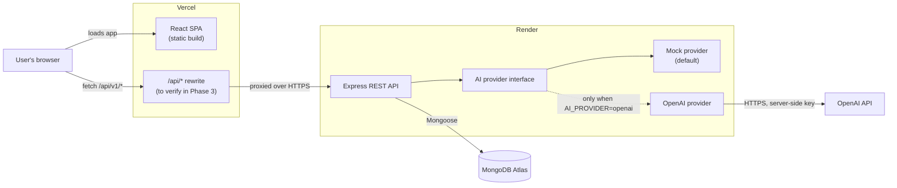
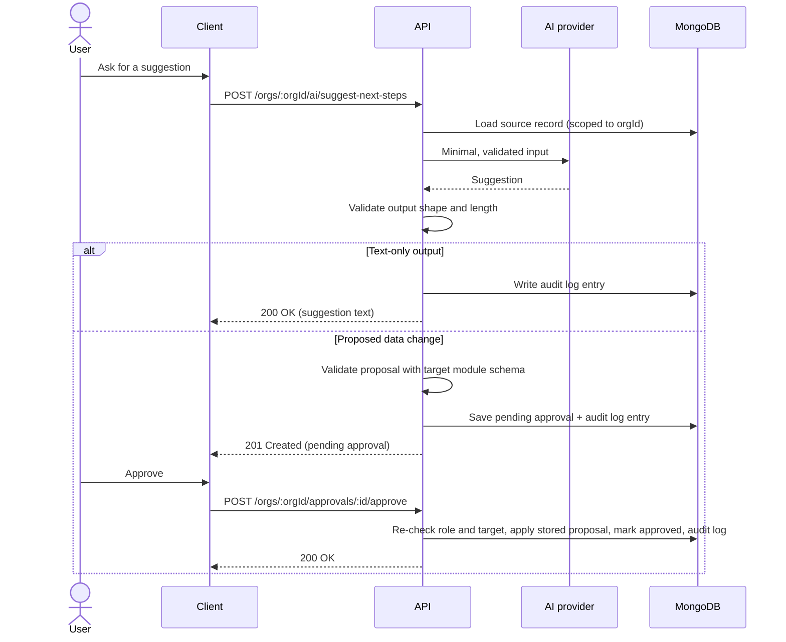

# OpsPilot AI: Architecture

> **Status: planned architecture.** Nothing in this document is implemented yet unless it is explicitly marked **Done**. Library names marked as *candidates* are not installed and will be confirmed in the phase that first needs them. The initial scaffold confirmed Express 5, helmet, Vitest, Supertest, and React Testing Library with jsdom.

## 1. System Overview

OpsPilot AI is planned as a multi-tenant web application. Each user belongs to one or more organizations, and each organization's data (customers, orders, tasks, approvals and audit logs) is isolated from every other organization's data. AI features produce summaries and suggestions. Any AI suggestion that would change data must be approved by a person before it is applied.

The planned system has four parts:

- **Client:** a React single-page app built with Vite and served as static files from Vercel.
- **Server:** a Node.js + Express REST API hosted on Render.
- **Database:** MongoDB Atlas, accessed only by the server.
- **AI provider:** a server-side interface with a `mock` implementation (default) and an `openai` implementation.



**Same-origin API calls (planned; must be verified in Phase 3).** The client will call `/api/v1/*` on its own origin. In development, the Vite dev server will proxy `/api` to the local Express server. In production, a Vercel rewrite will proxy `/api` to the Render service. This keeps the auth cookie first-party, avoids cross-site cookie restrictions, and removes the need for CORS in normal operation.

This approach is **unverified**. The deployment phases must confirm that the Vercel rewrite:

- forwards request headers (including `Origin` and `Cookie`) and response `Set-Cookie` headers correctly;
- has a proxy timeout long enough for AI calls and Render cold starts;
- passes the real client IP through to Express, so rate limiting works.

**Fallback if the rewrite is unsuitable:** serve the client and API from subdomains of one custom domain, for example `app.<domain>` and `api.<domain>`. These count as the same site, so `SameSite=Lax` cookies still work. The API would then use credentialed CORS restricted to `CLIENT_ORIGIN`.

Calling the default `*.onrender.com` API directly from a `*.vercel.app` page is **not** a viable fallback for cookie auth. Those are different sites, so it would need `SameSite=None` cookies, which some browsers block as third-party cookies.

## 2. Planned Monorepo Structure

```text
opspilot-ai/
├── client/                    # React + Vite + plain CSS
│   ├── index.html
│   ├── vite.config.js         # dev proxy for /api
│   └── src/
│       ├── main.jsx
│       ├── App.jsx            # routes and layout
│       ├── api/               # fetch wrapper and per-resource API functions
│       ├── components/        # shared UI components
│       ├── features/          # one folder per domain (auth, customers, orders, ...)
│       └── styles/            # global CSS, variables, resets
├── server/                    # Node.js + Express REST API
│   └── src/
│       ├── app.js             # builds the Express app (no listen); used by tests
│       ├── server.js          # loads config, connects to DB, starts listening
│       ├── config/            # environment loading and validation
│       ├── middleware/        # auth, org membership, validation, errors, rate limits
│       ├── lib/               # db connection, logger, error classes
│       ├── ai/                # provider interface, mock and openai providers
│       └── modules/           # one folder per domain
│           └── customers/     # e.g. routes, controller, service, model, schemas, tests
├── docs/
│   └── ARCHITECTURE.md
├── package.json           # npm workspaces and root scripts
├── CLAUDE.md
└── README.md
```

- Each domain module owns its routes, controller, service, Mongoose model and validation schemas, in line with the modular-code rule in `CLAUDE.md`.
- Splitting `app.js` from `server.js` lets HTTP tests run the app without opening a port or connecting to a real database.
- A root `package.json` uses npm workspaces for `client` and `server`, with scripts to run both apps in development, run all tests, and build the client.
- Each app has its own `.env.example`.

## 3. Responsibilities and Boundaries (Planned)

| Component | Responsible for | Must not |
| --- | --- | --- |
| **Client** | UI, routing, form usability checks, calling the API, rendering AI output as plain text | Hold secrets; be the only place permissions are enforced (it may hide controls, but the server decides); talk to the database or AI provider directly |
| **Server** | Authentication, authorization, input validation, business logic, organization isolation, AI orchestration, audit logging, error mapping | Trust client-supplied `organizationId`, `userId` or `role`; return stack traces or internal error details |
| **Database** | Persistence, unique constraints, indexes | Be reachable by anything other than the server; hold business logic |
| **AI provider** | Turn a prepared input into text output | Access the database; make authorization decisions; write data; be trusted (its output is validated like user input) |

## 4. Planned API Route Groups

All routes are planned and prefixed with `/api/v1`. Routes for organization-owned data are nested under `/orgs/:orgId`, so the active organization is explicit in every request and checked against the user's memberships.

**Common conventions (planned):**

- JSON request and response bodies.
- List endpoints accept `limit` (capped, for example at 100) and `page`.
- Errors use one envelope: `{ "error": { "code": "...", "message": "...", "details": [...] } }`.
- The exact fields of each resource are not decided yet. They will be defined when each module is built (see [Open Questions](#9-open-questions)).

| Group | Planned routes | Access |
| --- | --- | --- |
| **Health** | `GET /health` (liveness; **implemented**)<br>`GET /ready` (readiness; **implemented**: reports the MongoDB connection state when a database is configured, with 503 when it is not connected) | Public |
| **Auth** | `POST /auth/register`<br>`POST /auth/login`<br>`POST /auth/logout`<br>`GET /auth/me` | Public, except `logout` and `me` |
| **Organizations** | `GET /orgs` (my organizations)<br>`POST /orgs`<br>`GET /orgs/:orgId`<br>`PATCH /orgs/:orgId`<br>`GET /orgs/:orgId/members` | Authenticated; member of the org; changes need an admin role |
| **Customers** | `GET`, `POST /orgs/:orgId/customers`<br>`GET`, `PATCH`, `DELETE /orgs/:orgId/customers/:id` | Org member |
| **Orders** | `GET`, `POST /orgs/:orgId/orders`<br>`GET`, `PATCH`, `DELETE /orgs/:orgId/orders/:id` | Org member |
| **Tasks** | `GET`, `POST /orgs/:orgId/tasks`<br>`GET`, `PATCH`, `DELETE /orgs/:orgId/tasks/:id` | Org member |
| **AI tools** | `POST /orgs/:orgId/ai/summarize`<br>`POST /orgs/:orgId/ai/suggest-next-steps` | Org member; rate limited |
| **Approvals** | `GET /orgs/:orgId/approvals`<br>`GET /orgs/:orgId/approvals/:id`<br>`POST /orgs/:orgId/approvals/:id/approve`<br>`POST /orgs/:orgId/approvals/:id/reject` | Org member; deciding needs a permitted role |
| **Audit logs** | `GET /orgs/:orgId/audit-logs` | Org admin; read-only (there are no write endpoints) |

**Relationships between resources (planned):** an order references a customer. A task may optionally reference a customer or an order. Every reference must point to a record in the **same organization**, and the server checks this on create and update.

**AI tools and approvals (planned flow):**

- AI tools return text output. Output that does not change data, such as summaries and text-only suggestions, is returned directly and is not saved as an approval.
- If a tool proposes a data change (the exact kinds of change are still to be defined; one example is proposing a new task), the server checks the proposal with the target module's validation schema, then stores it as a **pending approval**. It does not apply it.
- Approvals are created only by the server. There is no client endpoint for creating one.
- The change is applied only when a permitted user approves it.
- At decision time the server re-checks:
  - the approver's membership and role;
  - that the target still exists in the same organization;
  - that the stored proposal still passes validation.
- The approve request carries no payload. The server applies only the stored proposal, so a client cannot change it at approval time.
- The status change uses an atomic conditional update (`pending` → `approved` / `rejected`), so the same approval cannot be applied twice.
- Where the data change and the status update must succeed together, they run in a MongoDB transaction.



**Audit log entries (planned)** record who did what: the organization, the acting user, the action, the target type and ID, a timestamp, and minimal metadata. They are written by the server for data changes, approval decisions and AI tool use. They never contain passwords, tokens or secrets.

## 5. Authentication and Organization Isolation

### Authentication (planned)

- **Passwords** are hashed with a vetted, slow hashing algorithm (*candidates:* argon2id or bcrypt) and are never logged or returned.
- **Sessions** use a signed JWT stored in an `httpOnly` cookie set with `Path=/`, `SameSite=Lax`, and `Secure` in production.
  - Verification pins the expected signing algorithm (for example HS256 with `JWT_SECRET`) and rejects anything else.
  - The token's expiry and the cookie's max age use the same lifetime. The exact value will be decided in Phase 4.
  - Tokens are never stored in `localStorage` or exposed to client JavaScript.
- **Expiry:** an expired or invalid token gets a 401. The client then clears its user state and shows the login page. There are no refresh tokens at first, so users sign in again, which keeps the design simple for a solo developer.
- **Logout and invalidation:**
  - Each user has a `tokenVersion`. It is included in the token and checked against the database on every authenticated request.
  - `POST /auth/logout` clears the cookie **and** increments `tokenVersion`, which invalidates all of that user's sessions, including any copied token. A password change (when added) will do the same.
  - Trade-off: logging out signs the user out on every device. Logging out of one device only would need a server-side session store (see [Open Questions](#9-open-questions)).
- **CSRF protection:**
  - `GET` and `HEAD` routes never change state.
  - State-changing requests must use `Content-Type: application/json` (otherwise 415).
  - They must also send an `Origin` header that matches `CLIENT_ORIGIN`; a missing or different `Origin` gets a 403.
  - Together with `SameSite=Lax` cookies, these rules block cross-site form and fetch attacks.
- **Brute-force protection:** login and register are rate limited by client IP, which needs the correct `trust proxy` setting (see [Section 6](#error-handling-planned)). Login is also limited per account. Login failures return a generic message that does not reveal whether the email exists.

### Organization-level data isolation (planned)

- Every organization-owned document stores an `organizationId`, and its indexes start with `organizationId`.
- A membership collection links users to organizations and stores a role. The initial roles are assumed to be `admin` and `member`, to be confirmed when the organizations module is built.
- Middleware on `/orgs/:orgId/*` checks the user's membership of `:orgId` against the database on every request, so a removed membership takes effect immediately. It then attaches the organization and role to the request.
  - A non-member gets **404**.
  - A member without the required role gets **403**.
- Services take `orgId` from that request context, never from the request body, and every database query on organization data includes it.
- Validation schemas strip unknown fields, so a client cannot set `organizationId`, `role` or other server-controlled fields (mass assignment).
- Requesting another organization's record returns **404**, not 403, so the response does not reveal that the record exists.
- Each organization-owned module must include isolation tests showing that a user in organization A cannot read, update or delete organization B's data.

## 6. Configuration, Secrets, Validation and Errors

### Environment variables

- On the server, environment variables are read in one place (`server/src/config/`), validated at startup, and exported as a frozen config object. Startup fails fast with a clear message if a required value is missing or invalid. For example, `AI_PROVIDER=openai` without `OPENAI_API_KEY` or `OPENAI_MODEL` stops the server instead of silently falling back to `mock`.
- No other server file reads `process.env` directly.
- The client can only see `VITE_*` variables, which are bundled into public JavaScript and must never hold secrets.
- The Vercel project gets only `VITE_*` variables. All server variables, and every secret, are set only on Render.

| Variable | Used by | Secret | Status |
| --- | --- | --- | --- |
| `NODE_ENV` | Server | No | In use; in `server/.env.example` (defaults to `development`) |
| `PORT` | Server | No | In use; in `server/.env.example` (defaults to `3000`; Render sets this automatically) |
| `VITE_API_BASE_URL` | Client | No | In use; in `client/.env.example` (defaults to `/api/v1`) |
| `API_PROXY_TARGET` | Vite dev server config only (not bundled) | No | In use; in `client/.env.example` (defaults to `http://localhost:3000`) |
| `CLIENT_ORIGIN` | Server | No | Planned (used for the Origin check and the CORS fallback) |
| `MONGODB_URI` | Server | **Yes** | In use; in `server/.env.example` (required in production, optional in development and test) |
| `AI_PROVIDER` | Server | No | Planned (`mock` or `openai`) |
| `OPENAI_API_KEY` | Server | **Yes** | Planned |
| `OPENAI_MODEL` | Server | No | Planned |
| `JWT_SECRET` | Server | **Yes** | Planned for the auth phase, with a minimum length checked at startup |

Planned variables are added to `server/.env.example` in the phase that first uses them.

**Env file location:** each app reads its own `.env`. The server loads `server/.env` with Node's `--env-file-if-exists` flag; real environment variables take precedence over the file. Vite loads `client/.env`.

**Secrets:** production secrets are set only in the Render and Vercel dashboards. The Atlas database user gets read/write access to the application database only. Secrets are never logged, sent to the client, or included in error responses.

### Input validation (planned)

- Every route validates `body`, `params` and `query` against a schema before the controller runs (*candidate:* Zod). Unknown fields are stripped and string lengths are limited.
- Route IDs are checked to be valid ObjectIds.
- Mongoose `sanitizeFilter` is enabled (set when the database connects) to block query-operator injection (for example `{ "$gt": "" }`).
- Text sent to the AI provider is size-limited. AI output is checked for shape and length, and is shown in the client as plain text, never as HTML.
- Client-side checks exist only to improve usability. The server is the authority.

### Error handling (planned)

- A central Express error handler maps known errors to status codes and the standard error envelope. Express 5, confirmed in the scaffold, passes errors from async route handlers to this handler automatically.

  | Status | Meaning |
  | --- | --- |
  | 400 | Validation failed |
  | 401 | Not authenticated |
  | 403 | Authenticated but not permitted |
  | 404 | Not found, or belongs to another organization |
  | 409 | Conflict, such as a duplicate email |
  | 429 | Rate limited |
  | 502 / 503 | AI provider failure or timeout |
  | 500 | Unexpected error, returned with a generic message only |

- Each request gets an ID that is included in logs and error responses so problems can be traced.
- Structured server logs redact passwords, tokens, cookies and API keys.
- Other baseline protections: security headers (helmet) and a 10 kB JSON body limit are in place. A timeout on outbound AI calls is planned.
- Express's `trust proxy` setting must match the real proxy chain (Vercel rewrite, then Render). This makes the client IP used for rate limiting correct and stops it being spoofed through `X-Forwarded-For`. The exact setting will be confirmed in Phase 3.

## 7. Testing and Deployment

### Testing strategy (planned)

Tests focus on behavior that matters, following `CLAUDE.md`. Vitest runs both test suites. The server uses Supertest for HTTP tests, and the client uses React Testing Library with jsdom. mongodb-memory-server (an isolated test database) remains a *candidate*.

| Level | Focus |
| --- | --- |
| Unit | Validation schemas, service logic, config validation, the mock AI provider's deterministic output |
| API integration | Status codes and response shapes, 401/403/404 paths, organization isolation, approval state transitions, audit log writes |
| AI provider | The `openai` provider tested with a mocked HTTP layer. **Automated tests never call the real OpenAI API.** |
| Client | Key components and forms (React Testing Library), with API calls mocked |

Tests for code that uses MongoDB transactions need a replica-set test database, because a standalone instance does not support transactions. mongodb-memory-server has a replica-set mode for this.

A CI workflow that runs lint and tests on each push (*candidate:* GitHub Actions) is planned once there is code to test.

### Deployment (planned)

| Component | Platform | Plan |
| --- | --- | --- |
| Client | **Vercel** | Root directory `client/`; Vite build output `dist/`; SPA fallback to `index.html`; rewrite `/api/*` to the Render service |
| Server | **Render** | Web Service with root directory `server/`; health check path `/api/v1/health`; environment variables set in the dashboard |
| Database | **MongoDB Atlas** | Separate databases for development and production; least-privilege database user; TLS (Atlas default) |

To verify at deployment time:

- Render's free tier sleeps when idle, so the first request after a pause can be slow.
- Atlas network access should be limited to Render's outbound IP addresses if they are available for the service. If not, a wider allowlist depends on strong credentials and a least-privilege user, and that trade-off should be documented.
- The Vercel `/api` rewrite needs checking: header and cookie forwarding, proxy timeout, and client IP forwarding (see [Section 1](#1-system-overview)). If it fails, use the custom-domain fallback described there.

## 8. Implementation Roadmap

Each phase is small and has a testable **done when** condition. Phase 1 is done and Phase 2 is in progress; nothing later is started.

| Phase | Scope | Done when |
| --- | --- | --- |
| **0. Foundation** (**Done**) | README, CLAUDE.md, .gitignore, .env.example | Files are reviewed and committed |
| **0b. Architecture doc** (**Done**) | This document | Reviewed and committed |
| **1. Server skeleton** (**Done**; choosing the request-validation library is deferred to Phase 4, the first phase that validates request bodies) | Confirm candidate libraries (Express version, validation, test runner); Express app, config validation, health routes, error handler, request IDs, logging | Tests pass for: `GET /health` returns 200, an unknown route returns a 404 envelope, and invalid config stops startup |
| **2. Client skeleton** (**In progress**: implemented and tested; the manual browser check is pending) | Vite + React app, base CSS, API wrapper, dev proxy, a page that shows API health | A component test passes, and the health status appears in the browser in development (manual check) |
| **3. Deploy the skeleton** | Render service, Vercel project, Atlas cluster, `/api` rewrite, `trust proxy` setting | The deployed client shows the deployed API's health through the rewrite (or the fallback is chosen and documented), and there are no secrets in the repo |
| **4. Auth** | User model, register/login/logout/me, password hashing, cookie session, CSRF checks, auth rate limits; add `JWT_SECRET` | Tests cover: success, bad credentials, missing or expired session (401), duplicate email (409), a token copied before logout being rejected, and a missing or foreign `Origin` getting 403. The auth cookie also works through the deployed rewrite (manual check). |
| **5. Organizations and isolation** | Organization and membership models, membership middleware, roles | The isolation test template passes, a non-member gets 404, and a member without the required role gets 403 |
| **6. Audit log service** | Audit log model, write helper, read endpoint | Org-admin-only read is enforced, and mutations in tests create entries |
| **7. Customers** | First organization-owned module; sets the pattern for later modules | CRUD, validation and isolation tests pass, and component tests for the client list and form pass |
| **8. Orders and tasks** | Two modules following the customer pattern, with same-organization reference checks | Tests pass, including rejection of references to another organization's records |
| **9. AI layer (mock)** | Provider interface, mock provider, summarize and suggest endpoints, rate limits | Endpoint tests pass with deterministic mock output, and a component test shows AI output containing HTML is displayed as plain text |
| **10. Approvals** | Pending approvals for AI-proposed data changes; approve and reject; transactions | Tests cover: an approval applies exactly once, the reject path, approver permissions, re-validation failure at approval time, text-only output not creating an approval, and audit entries |
| **11. OpenAI provider** | `openai` provider behind the same interface, with timeouts and error mapping | Tests pass with mocked HTTP; manual check with a real key in development only |
| **12. Hardening** | CI, basic accessibility check of the main pages (keyboard navigation, form labels), README update reflecting only verified features | CI runs lint and tests on every push and is green, the accessibility checklist is completed, and the README lists only features verified in the deployed app |

## 9. Open Questions

These are intentionally left undecided rather than assumed:

- The fields and statuses for customers, orders and tasks.
- Hard delete or archive (soft delete) for each module.
- The final roles and permissions, including whether users can approve their own requests.
- Which kinds of AI-proposed data change need approval, beyond the planned example.
- Session lifetime, and whether logout should sign out every device (planned default) or only the current one (needs a server-side session store).
- Whether a custom domain is needed (only if the Vercel rewrite fails verification).
- Inviting members to an organization (would need email delivery; not planned initially).
- JavaScript or TypeScript (this document assumes JavaScript with ES modules).
