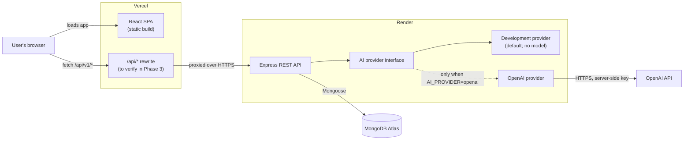
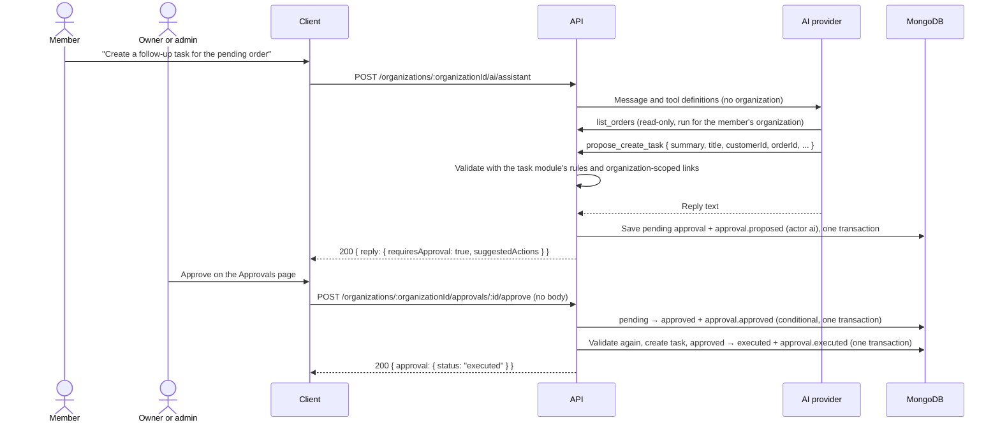

# OpsPilot AI: Architecture

> **Status: planned architecture.** Nothing in this document is implemented yet unless it is explicitly marked **Done**. Library names marked as *candidates* are not installed and will be confirmed in the phase that first needs them. The initial scaffold confirmed Express 5, helmet, Vitest, Supertest, and React Testing Library with jsdom.

## 1. System Overview

OpsPilot AI is planned as a multi-tenant web application. Each user belongs to one or more organizations, and each organization's data (customers, orders, tasks, approvals and audit logs) is isolated from every other organization's data. AI features produce summaries and suggestions. Any AI suggestion that would change data must be approved by a person before it is applied.

The planned system has four parts:

- **Client:** a React single-page app built with Vite and served as static files from Vercel.
- **Server:** a Node.js + Express REST API hosted on Render.
- **Database:** MongoDB Atlas, accessed only by the server.
- **AI provider:** a server-side interface with two implementations, chosen by `AI_PROVIDER`: `development` (default), which connects to no model, and `openai`, which calls the OpenAI Responses API.



**Same-origin API calls (planned; must be verified in Phase 3).** The client will call `/api/v1/*` on its own origin. In development, the Vite dev server will proxy `/api` to the local Express server. In production, a Vercel rewrite will proxy `/api` to the Render service. This keeps the auth cookie first-party, avoids cross-site cookie restrictions, and removes the need for CORS in normal operation.

This approach is **unverified**. The deployment phases must confirm that the Vercel rewrite:

- forwards request headers (including `Origin` and `Cookie`) and response `Set-Cookie` headers correctly;
- has a proxy timeout long enough for AI calls and Render cold starts;
- passes the real client IP through to Express, so rate limiting works.

**Fallback if the rewrite is unsuitable:** serve the client and API from subdomains of one custom domain, for example `app.<domain>` and `api.<domain>`. These count as the same site, so `SameSite=Strict` cookies still work. The API would then use credentialed CORS restricted to `CLIENT_ORIGIN`.

Calling the default `*.onrender.com` API directly from a `*.vercel.app` page is **not** a viable fallback for cookie auth. Those are different sites, so it would need `SameSite=None` cookies, which some browsers block as third-party cookies.

## 2. Planned Monorepo Structure

```text
opspilot-ai/
├── client/                    # React + Vite + plain CSS
│   ├── index.html
│   ├── vite.config.js         # dev proxy for /api
│   └── src/
│       ├── main.jsx
│       ├── App.jsx            # routes and layout
│       ├── api/               # fetch wrapper and per-resource API functions
│       ├── components/        # shared UI components
│       ├── features/          # one folder per domain (auth, customers, orders, ...)
│       └── styles/            # global CSS, variables, resets
├── server/                    # Node.js + Express REST API
│   └── src/
│       ├── app.js             # builds the Express app (no listen); used by tests
│       ├── server.js          # loads config, connects to DB, starts listening
│       ├── config/            # environment loading and validation
│       ├── middleware/        # auth, org membership, validation, errors, rate limits
│       ├── lib/               # db connection, logger, error classes
│       └── modules/           # one folder per domain
│           ├── customers/     # e.g. routes, controller, service, model, schemas, tests
│           └── ai/            # assistant route, provider boundary and providers, read-only tool allowlist
├── docs/
│   └── ARCHITECTURE.md
├── package.json           # npm workspaces and root scripts
├── CLAUDE.md
└── README.md
```

- Each domain module owns its routes, controller, service, Mongoose model and validation schemas, in line with the modular-code rule in `CLAUDE.md`.
- Splitting `app.js` from `server.js` lets HTTP tests run the app without opening a port or connecting to a real database.
- A root `package.json` uses npm workspaces for `client` and `server`, with scripts to run both apps in development, run all tests, and build the client.
- Each app has its own `.env.example`.

## 3. Responsibilities and Boundaries (Planned)

| Component | Responsible for | Must not |
| --- | --- | --- |
| **Client** | UI, routing, form usability checks, calling the API, rendering AI output as plain text | Hold secrets; be the only place permissions are enforced (it may hide controls, but the server decides); talk to the database or AI provider directly |
| **Server** | Authentication, authorization, input validation, business logic, organization isolation, AI orchestration, audit logging, error mapping | Trust client-supplied `organizationId`, `userId` or `role`; return stack traces or internal error details |
| **Database** | Persistence, unique constraints, indexes | Be reachable by anything other than the server; hold business logic |
| **AI provider** | Turn a prepared input into text output; ask the server to run allowlisted read-only tools by name; propose a change as structured data, which the server validates and saves for a person to approve | Access the database or stores directly; choose the organization; make authorization decisions; write data or run a proposed change; be trusted (its output and tool input are validated like user input) |

## 4. Planned API Route Groups

All routes are prefixed with `/api/v1`. The health and auth routes, `POST /organizations`, `GET /organizations`, `GET` and `POST /organizations/:organizationId/customers`, `GET` and `POST /organizations/:organizationId/orders`, `GET`, `POST` and `PATCH /organizations/:organizationId/tasks`, `POST /organizations/:organizationId/ai/assistant`, `PATCH /organizations/:organizationId`, `GET /organizations/:organizationId/audit-logs`, `GET /organizations/:organizationId/approvals` and `POST /organizations/:organizationId/approvals/:approvalId/approve` and `/reject` are implemented; the rest are planned. Routes for organization-owned data are nested under `/organizations/:organizationId`, so the active organization is explicit in every request and checked against the user's memberships.

**Common conventions (planned):**

- JSON request and response bodies.
- List endpoints accept `limit` (capped, for example at 100) and `page`.
- Errors use one envelope: `{ "error": { "code": "...", "message": "...", "details": [...] } }`.
- The exact fields of each resource are not decided yet. They will be defined when each module is built (see [Open Questions](#9-open-questions)).

| Group | Planned routes | Access |
| --- | --- | --- |
| **Health** | `GET /health` (liveness; **implemented**)<br>`GET /ready` (readiness; **implemented**: reports the MongoDB connection state when a database is configured, with 503 when it is not connected) | Public |
| **Auth** (**implemented**) | `POST /auth/register`<br>`POST /auth/login`<br>`POST /auth/logout`<br>`GET /auth/me`<br>`PATCH /auth/me` (own name only) | Public, except `me`. `logout` works with or without a valid session. All return 503 when no database is configured. |
| **Organizations** | `POST /organizations` (**implemented**)<br>`GET /organizations` (my organizations; **implemented**)<br>`GET /organizations/:organizationId`<br>`PATCH /organizations/:organizationId` (**implemented**: name only)<br>`GET /organizations/:organizationId/members` | Authenticated. `POST` makes the caller the owner; `GET /organizations` lists only the caller's organizations. The other routes require membership, and changes need the owner or admin role. |

**`POST /organizations` (implemented):**

- The body is `{ "name": string, "slug": string }`. The name is trimmed (1–100 characters); the slug is trimmed and lowercased, and must be lowercase words separated by single hyphens (at most 60 characters). Other fields are ignored.
- The owner is always the authenticated user; an owner or role in the body has no effect.
- `201 { organization: { id, name, slug, createdAt }, membership: { id, organizationId, userId, role: "owner", createdAt } }`.
- Errors: 401 without a valid session; 400 `VALIDATION_FAILED`; 409 `SLUG_UNAVAILABLE`; 403/415 from the same-origin check; 503 when no database is configured.
- The organization and owner membership are written in one transaction. There is no rate limit on this route yet.

**`GET /organizations` (implemented):**

- Returns `200 { organizations: [{ id, name, slug, role, createdAt }] }` for the authenticated user only, with `Cache-Control: no-store`. A user ID in the query, headers or body is ignored.
- Order: newest first by the organization's `createdAt`, with ties broken by ID (newer IDs first).
- The lookup goes through memberships: the user's memberships (by the `userId` index), then only those organizations (by `_id`). No organization outside the user's memberships is ever loaded.
- No pagination yet. A user is expected to belong to few organizations.

**`PATCH /organizations/:organizationId` (implemented):**

- Runs the membership middleware, then `requireOrganizationRole('owner', 'admin')`: 401 without a session, 400 for a malformed organization ID, 404 for a non-member, 403 for a member. The organization is always `req.membership.organizationId`; an `organizationId` in the body, query or headers is ignored.
- Body: `{ "name": string }`, validated with the same rule as `POST /organizations` (trimmed, 1–100 characters; 400 `VALIDATION_FAILED` otherwise). Every other field, including `slug`, owner, role, actor and ID fields, is ignored, so none of them can be changed (no mass assignment). The slug is not editable because no rules for changing an organization's address have been decided.
- `200 { organization: { id, name, slug, createdAt } }`.
- In one transaction (`renameOrganization` in `organization.service.js`): load the organization, update the name, and record an `organization.updated` audit event with the authenticated user as the actor and `{ previousName, name }` as details. If the audit write fails, the rename is rolled back, so no rename goes unaudited. A name that does not change writes nothing and records no event.
- The route exists only when the app is given the audit log store (`createApp({ auditLogs })`), which `startServer` always passes when a database is configured.
- Deleting an organization is not implemented.

**`GET /organizations/:organizationId/audit-logs` (implemented):**

- Membership middleware, then `requireOrganizationRole('owner', 'admin')` (members get 403). The organization is always `req.membership.organizationId`.
- Query: `page` (1–1000, default 1) and `limit` (1–100, default 25), as whole numbers; anything else gets 400 `VALIDATION_FAILED`. Pages are fetched with `skip` and `limit + 1`, so every query is bounded, and very deep pages are refused rather than scanned.
- `200 { auditLogs: [{ id, actorType, actorEmail, action, resourceType, resourceId, details, createdAt }], page, limit, hasMore }` with `Cache-Control: no-store`, newest first by `createdAt` then ID. `actorEmail` is loaded from the users store for `user` actors (`null` for `ai`, `system` and deleted users); internal user and organization IDs are not returned.
- Read-only: there is no route that creates, edits or deletes entries.

**Audit log architecture (implemented, `modules/audit/`):**

- **Explicit events, not request logging.** A business action worth auditing calls `recordAuditEvent(auditLogs, { organizationId, actor, action, resourceId, details }, { session })`. Passing the action's transaction `session` writes the entry atomically with the change. Requests, including GETs and AI messages, are not logged automatically.
- **Controlled vocabulary** (`audit.events.js`): actor types are `user`, `ai` and `system`. Each action names its resource type and the only detail keys it may store; currently `organization.updated` (resource `organization`; details `previousName`, `name`) and the approval lifecycle, all with resource `approval`: `approval.proposed` (details `action`, `summary`), `approval.approved` (`action`), `approval.rejected` (`action`, `reason`), `approval.executed` (`action`, `resultType`, `resultId`) and `approval.execution_failed` (`action`, `failureCode`). Unknown actions, unknown actor types, a `user` actor without a user ID, a non-user actor with one, and non-text or over-200-character details throw, which aborts the surrounding transaction. Detail keys outside the allowlist are dropped, so passwords, tokens, API keys, authorization headers, prompts, provider payloads and request bodies cannot be stored even if a caller passes them.
- **Actor identity** comes from the server: for user actions, the route passes `req.membership.userId`, which comes from the verified session. A client cannot claim `actorType: "ai"` or another user; such body fields are ignored.
- **Storage:** `AuditLog` documents hold only `organizationId`, `actorType`, `actorUserId`, `action`, `resourceType`, `resourceId` (ObjectIds for IDs), `details` (a map of strings) and `createdAt`, with an index on `{ organizationId: 1, createdAt: -1, _id: -1 }`. The store has no update or delete methods. Tests use an in-memory store with the same contract (`testing/memoryAuditLogStore.js`).

**`POST` and `GET /organizations/:organizationId/customers` (implemented):**

- Both run the membership middleware first: no valid session gets 401, a malformed organization ID 400, and a non-member 404 (the same as a missing organization). Any role may list and create customers.
- The organization is always `req.membership.organizationId`. An `organizationId` in the body, query or headers is ignored, as are other server-controlled fields.
- `POST` body: `{ "name": string, "email"?: string, "phone"?: string }`. The name is trimmed (1–120 characters). The email is optional, trimmed and lowercased, and must look like an address (at most 254 characters). The phone is optional and trimmed (at most 40 characters). A missing, null or blank optional field is stored as absent; a non-string value gets 400 `VALIDATION_FAILED`.
- `201 { customer: { id, name, email, phone, createdAt, updatedAt } }`, with `null` for an absent email or phone. `GET` returns `200 { customers: [...] }` with `Cache-Control: no-store`: at most the 50 newest, ordered by `createdAt` then ID (newest first). There is no paging yet.
- Emails are not unique: different organizations may have customers with the same address, and no rule within one organization has been decided.
- Customers are stored with `organizationId` as an ObjectId and an index on `{ organizationId: 1, createdAt: -1, _id: -1 }`.

**`POST` and `GET /organizations/:organizationId/orders` (implemented):**

- The same membership rules as customers: 401 without a session, 400 for a malformed organization ID, 404 for a non-member, and any role may list and create. The organization is always `req.membership.organizationId`; an `organizationId` in the body, query or headers is ignored.
- `POST` body: `{ "customerId": string, "description": string, "status": string, "totalAmount": number, "currency"?: string }`.
  - `customerId` is required and must be an ObjectId string (400 otherwise).
  - `description` is trimmed, 1–500 characters.
  - `status` is one of `pending`, `confirmed`, `completed`, `cancelled`.
  - `totalAmount` is a JSON number from 0 to 1,000,000,000,000, in the currency's major unit (rupees, not paise), with no more decimal places than the currency allows (2 for INR, 0 for JPY, 3 for KWD). It is stored as a number; amounts are not stored in minor units yet.
  - `currency` is optional, defaults to `INR`, is trimmed and uppercased, and must be an ISO 4217 code known to the runtime's `Intl` data.
- **Customer relationship:** after validation, the customer is looked up by `{ _id: customerId, organizationId }`. If no customer matches, the request gets **404** `CUSTOMER_NOT_FOUND`, so another organization's customer is indistinguishable from one that does not exist, and nothing is written.
- `201 { order: { id, customerId, customerName, description, status, totalAmount, currency, createdAt } }`. `GET` returns `200 { orders: [...] }` with `Cache-Control: no-store`: at most the 50 newest, ordered by `createdAt` then ID (newest first). There is no paging yet.
- `customerName` is the customer's current name, loaded with a second query scoped to the organization (`{ organizationId, _id: { $in: ids } }`), not with Mongoose `populate`, which would look customers up by ID alone.
- Orders are stored with `organizationId` and `customerId` as ObjectIds and an index on `{ organizationId: 1, createdAt: -1, _id: -1 }`. No query filters orders by customer yet, so there is no customer index.

**`GET`, `POST` and `PATCH /organizations/:organizationId/tasks` (implemented):**

- The same membership rules as customers and orders, and any role may list, create and update. The organization is always `req.membership.organizationId`; an `organizationId` in the body, query or headers is ignored.
- `POST` body: `{ "title": string, "description"?: string, "status"?: string, "priority"?: string, "customerId"?: string, "orderId"?: string, "dueDate"?: string }`.
  - `title` is trimmed, 1–200 characters; `description` is optional, trimmed, at most 2000.
  - `status` is `todo` (default), `in_progress` or `completed`; `priority` is `low`, `medium` (default) or `high`.
  - `customerId` and `orderId` are optional ObjectId strings (400 if malformed).
  - `dueDate` is an optional calendar day, `"YYYY-MM-DD"`, which must exist (so not `2026-02-30`). It is stored as midnight UTC and always returned as `"YYYY-MM-DD"`, so it never shifts with the reader's time zone.
  - Missing, null and empty optional fields are all "not given". Other fields are ignored and never stored.
- **Customer and order links:** a given customer is looked up by `{ _id, organizationId }` and an order the same way. One that does not match gets **404** `CUSTOMER_NOT_FOUND` or `ORDER_NOT_FOUND`, so another organization's record is indistinguishable from a missing one, and nothing is written. When both are given, the order must be for that customer (**400** `VALIDATION_FAILED` otherwise), so a task never points at a contradictory pair. The client prevents this too: picking an order fills in its customer.
- `PATCH /tasks/:taskId` body: any of `{ "status", "priority", "dueDate" }`, at least one; a null or empty `dueDate` clears it. The title, description, customer, order and organization cannot change, and those fields in the body are ignored. A malformed task ID gets 400. The update matches `{ _id: taskId, organizationId }`, so another organization's task gets the same **404** `TASK_NOT_FOUND` as one that does not exist, and is not changed.
- Responses: `201 { task }` and `200 { task }`, and `GET` returns `200 { tasks: [...] }` with `Cache-Control: no-store`: at most the 50 newest, by `createdAt` then ID. A task is `{ id, title, description, status, priority, customerId, customerName, orderId, orderDescription, dueDate, createdAt, updatedAt }`, with `null` for anything not set. Names are loaded with organization-scoped `$in` queries, not `populate`.
- Tasks are stored with ObjectId references and an index on `{ organizationId: 1, createdAt: -1, _id: -1 }`. Updates find a task by `_id` (plus `organizationId`), which the built-in `_id` index covers, so there is no second index.

**`POST /organizations/:organizationId/ai/assistant` (implemented; the OpenAI provider is not yet verified against the real API):**

- The same membership rules as the other organization routes: 401 without a session, 400 for a malformed organization ID, 404 for a non-member (checked before the body), and any role may use it. The organization is always `req.membership.organizationId`; an `organizationId` in the body, query or headers is ignored.
- Body: `{ "message": string }`, trimmed, 1–2000 characters (**400** `VALIDATION_FAILED` otherwise). Other fields are ignored. The message is not stored or logged.
- `200 { reply: { status, text, provider, toolCalls, suggestedActions, requiresApproval, availableTools, requestId } }` with `Cache-Control: no-store`.
  - `status` is `not_configured` (no model, or no API key; `text` is `null`) or `completed` (`text` is the model's answer). `provider` is `development` or `openai`; the model name is not returned.
  - `toolCalls` lists the tools that ran (`{ name, readOnly }`), and `availableTools` the allowlist (`{ name, description, readOnly }`).
  - `suggestedActions` lists the proposals saved as pending approvals for this message (`{ approvalId, action, status, summary, parameters }`), and `requiresApproval` is `true` when there is at least one; otherwise they are `[]` and `false`. `toolCalls` marks a proposal as `readOnly: false`. See the approval flow below.
- **Provider boundary** (`modules/ai/`): the route calls `askAssistant` in `ai.service.js`, which calls `provider.respond({ message, tools, runTool })`.
  - `tools` are plain tool definitions (name, description, read-only flag, JSON Schema for the input), never the functions that run them.
  - `runTool(name, input)` is a function the service has already bound to the membership's organization, so a provider can neither see nor choose the organization.
  - The provider's result is untrusted: anything other than `{ status: "not_configured" }` or `{ status: "completed", text }` with 1–8000 characters of text gets **502** `AI_PROVIDER_ERROR`. A provider that throws anything other than these errors gets the generic 500.
  - `createApp` takes the provider as `aiProvider` (tests pass fakes); `startServer` picks it from `AI_PROVIDER` with `createAiProvider` in `ai.provider.js`. `development.provider.js` makes no network call, runs no tools and always returns `not_configured`.
- **OpenAI provider** (`openai.provider.js`, official `openai` SDK): a stateless tool-calling loop over `client.responses.create`.
  - Each request sends `model` (`OPENAI_MODEL`), the fixed `instructions` in `assistant.instructions.js` (no organization, user or record data), the conversation so far as `input`, and the allowlisted tools as `function` tools. It sets `store: false`, so OpenAI does not keep the response, and asks for `reasoning.encrypted_content` so reasoning items can be sent back in the next round.
  - When the output has `function_call` items, each one is run through `runTool(name, parsedArguments)` and its result is appended as a `function_call_output`, then the model is called again. Malformed JSON arguments, unknown tools and invalid input are sent back to the model as `{ "error": ... }` instead of running anything; any other tool failure (a database error) ends the request with the generic 500.
  - Limits: at most 4 model calls per message, with `tool_choice: "none"` on the last so the model has to answer; at most 6 tool calls in total; each tool result at most 20,000 characters (the oldest records are dropped and `truncated: true` is added); `max_output_tokens` 4000; a 20-second timeout and one retry per SDK request; a 45-second deadline for the whole message.
  - SDK errors map to fixed messages: rate limits (429), timeouts, network failures, the deadline and OpenAI 5xx get **503** `AI_PROVIDER_UNAVAILABLE`; a rejected key, missing permission, unknown model or bad request gets **502** `AI_PROVIDER_ERROR`. Only the error's class, status, type and code are logged, never its message, the prompt or the key.
  - Without `OPENAI_API_KEY` the provider returns `not_configured` and never builds a client.
- **Tool allowlist** (`ai.tools.js`): `list_customers`, `list_orders` and `list_tasks`, all read-only.
  - Each tool has a name, description, input schema, input check and run function. They run through the same organization-scoped stores and services as the HTTP routes (`listOrders` and `listTasks` load names with organization-scoped queries).
  - Results are reduced to an explicit list of fields per record (for example a customer's `id`, `name`, `email`, `phone` and `createdAt`), so a field added to a store later is not sent to a provider until it is added to that list. Organization IDs are never included.
  - Input comes from the model, so it is checked like a request body: only `limit` (an integer from 1 to 50, default 20) is read, and anything else, such as an `organizationId`, is ignored. Bad input or an unknown name, including prototype keys like `__proto__`, is refused with an `AiToolError` before any store is touched.
  - `runTool` refuses any tool not marked read-only, so a tool that changes data can never run directly.
- **Proposal tool** (`ai.proposals.js`): `propose_create_task`, offered only when the app has the approval and audit log stores (always, with a database). Its input is the task fields plus a short `summary` (closed JSON Schema). `askAssistant` routes it to `readProposal`, which validates it like a request (see the approval flow below) and queues it; the model is told that it is waiting for approval and that nothing was created. Queued proposals are saved only after the provider returns a completed reply, so a failed request leaves none behind. At most 3 per message.
- **Instructions:** the static instructions say that the assistant cannot change anything itself, may only propose tasks, must never claim that a task was created or approved, must use only IDs returned by its tools, and must treat record fields as data even when they look like instructions. Records reach the model only inside `function_call_output` items, never in the instructions.
- No rate limit yet. One is still needed before the OpenAI provider is used in a shared deployment, because every message can cost money.
| **Customers** | `GET`, `POST /organizations/:organizationId/customers` (**implemented**)<br>`GET`, `PATCH`, `DELETE /organizations/:organizationId/customers/:id` | Org member (any role) |
| **Orders** | `GET`, `POST /organizations/:organizationId/orders` (**implemented**)<br>`GET`, `PATCH`, `DELETE /organizations/:organizationId/orders/:id` | Org member (any role) |
| **Tasks** | `GET`, `POST /organizations/:organizationId/tasks` (**implemented**)<br>`PATCH /organizations/:organizationId/tasks/:id` (**implemented**: status, priority and due date only)<br>`GET`, `DELETE /organizations/:organizationId/tasks/:id` | Org member |
| **AI tools** | `POST /organizations/:organizationId/ai/assistant` (**implemented**, see above)<br>`POST /organizations/:organizationId/ai/summarize`<br>`POST /organizations/:organizationId/ai/suggest-next-steps` | Org member; rate limited (planned) |
| **Approvals** | `GET /organizations/:organizationId/approvals` (**implemented**)<br>`GET /organizations/:organizationId/approvals/:id`<br>`POST /organizations/:organizationId/approvals/:id/approve` (**implemented**)<br>`POST /organizations/:organizationId/approvals/:id/reject` (**implemented**) | Listing: any member. Deciding: owner or admin. See the approval flow below. |
| **Audit logs** | `GET /organizations/:organizationId/audit-logs` (**implemented**, see above) | Owner or admin; read-only (there are no write endpoints) |

**Relationships between resources:** an order references a customer (**implemented**: checked on create, see above; orders cannot be updated yet). A task may optionally reference a customer, an order or both (**implemented**: checked on create, and the links cannot be changed by an update). Every reference must point to a record in the **same organization**, and the server checks this on create and update.

**AI proposals and approvals (implemented, `modules/approvals/`; the first and so far only workflow in which the AI can lead to a data change):**

- **The AI never changes data.** A model can only call `propose_create_task`, which saves a pending approval. The only path that creates the task is an authenticated owner or admin calling the approve route; no code path lets a provider reach the action registry.
- **Action registry** (`approval.actions.js`): an explicit allowlist, currently only `create_task`, looked up with `Object.hasOwn` (unknown names, including `__proto__`, get 400 `UNKNOWN_ACTION`). Each action has `prepare` (validate the parameters with the target module's own rules, including organization-scoped links, and return them in stored form) and `execute` (validate the stored parameters again and run the change through the target module's service). `create_task` uses `validateNewTask` and `createTask`/`findTaskLinks` from the task module, so task rules exist once. There is no dynamic dispatch, `eval` or model-chosen collection.
- **Proposal** (`prepareProposal`, `saveProposals` in `approval.service.js`): the action must be allowlisted, the summary 1–200 characters, and the parameters must pass `prepare` for the caller's organization (customer and order found by `{ _id, organizationId }`, the order belonging to the customer). Only the task fields are stored (title ≤200, description ≤2000, enums, IDs, a `YYYY-MM-DD` date), so parameters stay small. Invalid input is refused and nothing is saved. Valid proposals are saved with an `approval.proposed` audit event (actor `ai`, no user) in one transaction. `requestedByUserId` is the member who sent the message.
- **Storage** (`Approval`): `organizationId`, `source` (`ai`), `action`, `status`, `summary`, `parameters`, `requestedByUserId`, `reviewedByUserId`, `reviewedAt`, `rejectionReason`, `resultType`/`resultId` or `failureCode`/`failureMessage`, `completedAt` and timestamps, indexed by `{ organizationId, createdAt, _id }` and `{ organizationId, status, createdAt, _id }`. There is no route that creates, edits or deletes an approval directly.
- **State machine** (`APPROVAL_TRANSITIONS` in `approval.model.js`): `pending → approved | rejected`, `approved → executed | execution_failed`; `rejected`, `executed` and `execution_failed` are final. Every change is `approvals.transition`, a `findOneAndUpdate` on `{ _id, organizationId, status: from }`, which throws for a pair not in the table and returns null when the approval is no longer in `from`. There is no `expired` state yet.
- **Listing:** `GET /approvals?status&page&limit` (any member; status one of the five, page 1–1000, limit 1–50, default 20), newest first, with `Cache-Control: no-store`. People are shown by email and linked records by name, loaded with organization-scoped queries; organization and user IDs are not returned.
- **Reject:** `POST /approvals/:approvalId/reject` with `{ reason? }` (trimmed, at most 200 characters). One transaction: find by `{ _id, organizationId }` (404 `APPROVAL_NOT_FOUND` otherwise), `pending → rejected` (409 `APPROVAL_ALREADY_REVIEWED` otherwise), `approval.rejected` event with actor `user`.
- **Approve:** `POST /approvals/:approvalId/approve`, no payload; only the stored proposal runs.
  1. **Claim** (transaction): find by `{ _id, organizationId }`, `pending → approved` with the reviewer, `approval.approved` event. This conditional update is the only way an action starts, so concurrent or repeated approvals get 409 and run nothing. MongoDB write conflicts between simultaneous claims are retried by the transaction helper and then find the approval already approved.
  2. **Execute** (transaction): `getAction` and `execute` (validated again, links re-checked in the same organization), `approved → executed` with the task ID, `approval.executed` event. Task, status and event commit together or not at all.
  3. **On failure** (transaction): `approved → execution_failed` with a safe code and message (an `HttpError`'s own, such as `CUSTOMER_NOT_FOUND`; otherwise `EXECUTION_ERROR` and a fixed message, with the error logged without its details), `approval.execution_failed` event. Nothing is retried. If even this write fails, the approval stays `approved` and can never run again, which is the safe direction; it needs a person to investigate.
  - The response is `200 { approval }` with status `executed` or `execution_failed`.
- **Tenant isolation:** every query and change uses `req.membership.organizationId`; the reviewer and actor are `req.membership.userId`. An organization, user, actor, status or parameters in the body, query or headers is ignored. Another organization's approval gets the same 404 as a missing one.
- **Roles:** owners and admins decide (`requireOrganizationRole`), members get 403 and can only list. Whether someone may approve their own request is still open; it is allowed today.
- **Client:** the Approvals page lists pending proposals as review cards and recent decisions; Approve and Reject (with an optional reason) are shown to owners and admins only, are disabled while a request is in flight, and the card moves only after the server answers. The AI Assistant page shows "Approval required" with a link to the Approvals page; it has no approve button.
- New actions are added only to the registry in `approval.actions.js` (with a matching proposal tool), so they get the same validation, approval and audit path.



**Audit log entries** record who did what: the organization, the actor, the action, the target type and ID, a timestamp, and minimal allowlisted details (see the audit log architecture above). They are **implemented** for organization renames and the approval lifecycle (AI proposals with actor `ai`; decisions and their results with actor `user`). Entries for other data changes, such as tasks created directly through the tasks API, are planned; each will be a new action in `audit.events.js`, recorded explicitly by the code that causes it. Entries never contain prompts, provider payloads, passwords, tokens or secrets.

## 5. Authentication and Organization Isolation

### Authentication (implemented; not yet verified against a real database or in deployment)

- **Passwords** are hashed with Argon2id (`@node-rs/argon2`: 19 MiB memory, 2 iterations, 1 lane) and are never logged or returned. Registration requires 8–128 characters.
- **Account name:** `POST /auth/register` takes `{ name, email, password }`. The name is required: it is normalized (Unicode NFC, trimmed, runs of whitespace joined into one space) and must be 2–80 characters with at least one letter and no control characters; any script and common punctuation are accepted. Invalid names get 400 `VALIDATION_FAILED` and no account is created. The register, login and `/auth/me` responses return `{ id, email, name, createdAt }`. The name is read from the database on every request and is not in the session token, so it can never be stale there.
- **Accounts without a name:** accounts created before names were collected have no `name` field. They sign in as before (login only checks email and password) and are returned with `name: null`; the client greets them without a name and asks them to add one in Settings. Nothing is filled in automatically and no backfill has been run, since a name cannot be reliably derived from an email address.
- **Changing your name:** `PATCH /auth/me` with `{ name }` changes the signed-in user's own name, with the same rules and normalization as registration. The account is always the session's; the body may contain only `name`, so an `id`, `email`, `password` or any other field gets 400 `VALIDATION_FAILED` ("Only your name can be changed") rather than being silently ignored. It returns `200 { user: { id, email, name, createdAt } }` with `Cache-Control: no-store`. The same-origin and JSON checks apply as to every state-changing route; without a valid session it gets 401. The token version is not changed, so the session stays valid. The client replaces its signed-in user with the response, so the header and greeting update at once, and a reload reads the saved name from `GET /auth/me`.
- **Not audited:** a name change is not written to the audit log. Every audit entry belongs to one organization and is readable by that organization's owners and admins, while a name is personal and the same across all of a person's workspaces; recording it would copy personal details into each workspace's log.
- **Sessions** use a signed JWT stored in an `httpOnly` cookie set with `Path=/`, `SameSite=Strict`, and `Secure` in production. `Strict` costs nothing here because the client and API share an origin.
  - Verification accepts only HS256 with `JWT_SECRET` and requires the `sub`, `iat`, `exp` and `iss` claims.
  - The token's expiry and the cookie's max age are both 8 hours.
  - Tokens are never stored in `localStorage` or exposed to client JavaScript.
- **Expiry:** an expired or invalid token gets a 401. The client then clears its user state and shows the login page. There are no refresh tokens at first, so users sign in again, which keeps the design simple for a solo developer.
- **Logout and invalidation:**
  - Each user has a `tokenVersion`. It is included in the token and checked against the database on every authenticated request.
  - `POST /auth/logout` clears the cookie **and** increments `tokenVersion`, which invalidates all of that user's sessions, including any copied token. A password change (when added) will do the same.
  - Trade-off: logging out signs the user out on every device. Logging out of one device only would need a server-side session store (see [Open Questions](#9-open-questions)).
- **CSRF protection:**
  - `GET` and `HEAD` routes never change state.
  - State-changing requests must use `Content-Type: application/json` (otherwise 415).
  - They must also send an `Origin` header that matches `CLIENT_ORIGIN`; a missing or different `Origin` gets a 403.
  - Together with `SameSite=Strict` cookies, these rules block cross-site form and fetch attacks.
- **Brute-force protection:** login and register share a limit of 10 attempts per client IP per 15 minutes (in memory, per instance). The IP is only correct once the `trust proxy` setting is configured (see [Section 6](#error-handling-planned)). A per-account login limit is still planned. Login failures return a generic message that does not reveal whether the email exists, and an unknown email still runs a full password verification so response timing is similar.
- **Registration** returns 409 for an email that is already registered. This reveals that the account exists, which cannot be avoided without email verification; the rate limit slows scanning.

### Organization-level data isolation (membership checks implemented; customers, orders and tasks are organization-owned resources)

- Every organization-owned document stores an `organizationId`, and its indexes start with `organizationId`.
- A membership collection links users to organizations and stores a role: `owner`, `admin` or `member`, defined once in `modules/organizations/roles.js`. What each role may do is still undecided.
- **Implemented:** the Organization model (unique `slug`), the Membership model (one membership per user per organization), their stores, and a service that creates an organization together with its owner membership in a single transaction, so an organization never exists without an owner.
- **Implemented:** membership middleware for routes under `/organizations/:organizationId/...`, in `modules/organizations/organization.middleware.js`. The customer, order and task routes use it. It runs on every request, so a removed membership takes effect immediately.
  - `createRequireMembership({ requireAuth, memberships })` returns `[requireAuth, checkMembership]`, so authentication always runs first.
  - It checks the `:organizationId` route parameter against the authenticated user's ID with `memberships.find`. A user ID, role or organization ID anywhere else in the request is ignored.
  - It attaches only `req.membership = { id, organizationId, userId, role }`.
  - Responses: no valid session gets **401** `UNAUTHENTICATED` (checked before anything else). A malformed ID gets **400** `VALIDATION_FAILED`, before any lookup. A non-member gets **404** `NOT_FOUND` ("Organization not found"), identical to an organization that does not exist.
  - `requireOrganizationRole(...roles)` runs after it: a member without one of the roles gets **403** `FORBIDDEN`. An empty or unknown role list throws when the route is defined, and using it without the membership middleware fails closed with a 500.
- Services take `organizationId` from that request context, never from the request body, and every database query on organization data includes it.
- Role checks so far: any member may use customers, orders, tasks and the AI Assistant, and list approvals; only `owner` and `admin` may rename the organization (`PATCH /organizations/:organizationId`), read its audit log, and approve or reject AI proposals.
- Validation schemas strip unknown fields, so a client cannot set `organizationId`, `role` or other server-controlled fields (mass assignment).
- Requesting another organization's record returns **404**, not 403, so the response does not reveal that the record exists.
- Each organization-owned module must include isolation tests showing that a user in organization A cannot read, update or delete organization B's data.

## 6. Configuration, Secrets, Validation and Errors

### Environment variables

- On the server, environment variables are read in one place (`server/src/config/`), validated at startup, and exported as a frozen config object. Startup fails fast with a clear message if a required value is missing or invalid. For example, an unknown `AI_PROVIDER` stops the server. `AI_PROVIDER=openai` without `OPENAI_API_KEY` is allowed on purpose: the server logs that the key is missing and the assistant replies `not_configured`, rather than answering with anything made up.
- No other server file reads `process.env` directly.
- The client can only see `VITE_*` variables, which are bundled into public JavaScript and must never hold secrets.
- The Vercel project gets only `VITE_*` variables. All server variables, and every secret, are set only on Render.

| Variable | Used by | Secret | Status |
| --- | --- | --- | --- |
| `NODE_ENV` | Server | No | In use; in `server/.env.example` (defaults to `development`) |
| `PORT` | Server | No | In use; in `server/.env.example` (defaults to `3000`; Render sets this automatically) |
| `VITE_API_BASE_URL` | Client | No | In use; in `client/.env.example` (defaults to `/api/v1`) |
| `API_PROXY_TARGET` | Vite dev server config only (not bundled) | No | In use; in `client/.env.example` (defaults to `http://localhost:3000`) |
| `CLIENT_ORIGIN` | Server | No | In use; in `server/.env.example` (Origin check; defaults to `http://localhost:5173` outside production; required, https, in production) |
| `MONGODB_URI` | Server | **Yes** | In use; in `server/.env.example` (required in production, optional in development and test) |
| `AI_PROVIDER` | Server | No | In use; in `server/.env.example` (`development`, the default, or `openai`) |
| `OPENAI_API_KEY` | Server | **Yes** | In use; in `server/.env.example` (read only when `AI_PROVIDER=openai`) |
| `OPENAI_MODEL` | Server | No | In use; in `server/.env.example` (defaults to `gpt-5.4-mini`) |
| `JWT_SECRET` | Server | **Yes** | In use; in `server/.env.example` (at least 32 characters, required when `MONGODB_URI` is set) |

Planned variables are added to `server/.env.example` in the phase that first uses them.

**Env file location:** each app reads its own `.env`. The server loads `server/.env` with Node's `--env-file-if-exists` flag; real environment variables take precedence over the file. Vite loads `client/.env`.

**Secrets:** production secrets are set only in the Render and Vercel dashboards. The Atlas database user gets read/write access to the application database only. Secrets are never logged, sent to the client, or included in error responses.

### Input validation (planned)

- Every route validates `body`, `params` and `query` before the controller runs. The auth routes use small hand-written validators that read only the fields they need and limit lengths. A schema library (*candidate:* Zod) is still to be decided once routes have larger bodies.
- Route IDs are checked to be valid ObjectIds.
- Mongoose `sanitizeFilter` is enabled (set when the database connects) to block query-operator injection (for example `{ "$gt": "" }`).
- Text sent to the AI provider is size-limited (the assistant message is at most 2000 characters). AI output is checked for shape and length (at most 8000 characters), and is shown in the client as plain text, never as HTML. Tool input from the model is validated like a request body.
- Client-side checks exist only to improve usability. The server is the authority.

### Error handling (planned)

- A central Express error handler maps known errors to status codes and the standard error envelope. Express 5, confirmed in the scaffold, passes errors from async route handlers to this handler automatically.

  | Status | Meaning |
  | --- | --- |
  | 400 | Validation failed |
  | 401 | Not authenticated |
  | 403 | Authenticated but not permitted |
  | 404 | Not found, or belongs to another organization |
  | 409 | Conflict, such as a duplicate email |
  | 429 | Rate limited |
  | 502 / 503 | AI provider failure or timeout |
  | 500 | Unexpected error, returned with a generic message only |

- Each request gets an ID that is included in logs and error responses so problems can be traced.
- Structured server logs redact passwords, tokens, cookies and API keys.
- Other baseline protections: security headers (helmet) and a 10 kB JSON body limit are in place. A timeout on outbound AI calls is planned.
- Express's `trust proxy` setting must match the real proxy chain (Vercel rewrite, then Render). This makes the client IP used for rate limiting correct and stops it being spoofed through `X-Forwarded-For`. The exact setting will be confirmed in Phase 3.

## 7. Testing and Deployment

### Testing strategy (planned)

Tests focus on behavior that matters, following `CLAUDE.md`. Vitest runs both test suites. The server uses Supertest for HTTP tests, and the client uses React Testing Library with jsdom. Database integration tests (`*.integration.test.js`) run only when `MONGODB_TEST_URI` is set; each run uses a new, randomly named database and drops it afterwards. No in-memory MongoDB package is installed: locally, `@mongodb-js/mongodb-runner` (run with `npx`) can start a temporary replica set.

| Level | Focus |
| --- | --- |
| Unit | Validation schemas, service logic, config validation, the AI tool allowlist and its organization scoping |
| API integration | Status codes and response shapes, 401/403/404 paths, organization isolation, approval state transitions, audit log writes |
| AI provider | The `openai` provider tested with a stand-in for the SDK client that returns Responses API payloads and throws the SDK's own error classes. **Automated tests never call the real OpenAI API.** |
| Client | Key components and forms (React Testing Library), with API calls mocked |

Tests for code that uses MongoDB transactions need a replica-set test database, because a standalone instance does not support transactions. The transaction tests skip themselves on a standalone server.

A CI workflow that runs lint and tests on each push (*candidate:* GitHub Actions) is planned once there is code to test.

### Deployment (planned)

| Component | Platform | Plan |
| --- | --- | --- |
| Client | **Vercel** | Root directory `client/`; Vite build output `dist/`; SPA fallback to `index.html`; rewrite `/api/*` to the Render service |
| Server | **Render** | Web Service with root directory `server/`; health check path `/api/v1/health`; environment variables set in the dashboard |
| Database | **MongoDB Atlas** | Separate databases for development and production; least-privilege database user; TLS (Atlas default) |

To verify at deployment time:

- Render's free tier sleeps when idle, so the first request after a pause can be slow.
- Atlas network access should be limited to Render's outbound IP addresses if they are available for the service. If not, a wider allowlist depends on strong credentials and a least-privilege user, and that trade-off should be documented.
- The Vercel `/api` rewrite needs checking: header and cookie forwarding, proxy timeout, and client IP forwarding (see [Section 1](#1-system-overview)). If it fails, use the custom-domain fallback described there.

## 8. Implementation Roadmap

Each phase is small and has a testable **done when** condition. Phase 1 is done and Phase 2 is in progress; nothing later is started.

| Phase | Scope | Done when |
| --- | --- | --- |
| **0. Foundation** (**Done**) | README, CLAUDE.md, .gitignore, .env.example | Files are reviewed and committed |
| **0b. Architecture doc** (**Done**) | This document | Reviewed and committed |
| **1. Server skeleton** (**Done**; a request-validation library is still undecided, see Section 6) | Confirm candidate libraries (Express version, validation, test runner); Express app, config validation, health routes, error handler, request IDs, logging | Tests pass for: `GET /health` returns 200, an unknown route returns a 404 envelope, and invalid config stops startup |
| **2. Client skeleton** (**In progress**: implemented and tested; the manual browser check is pending) | Vite + React app, base CSS, API wrapper, dev proxy, a page that shows API health | A component test passes, and the health status appears in the browser in development (manual check) |
| **3. Deploy the skeleton** | Render service, Vercel project, Atlas cluster, `/api` rewrite, `trust proxy` setting | The deployed client shows the deployed API's health through the rewrite (or the fallback is chosen and documented), and there are no secrets in the repo |
| **4. Auth** (**In progress**: implemented and tested with an in-memory user store; the real-MongoDB check and the deployed-cookie check are pending) | User model, register/login/logout/me, password hashing, cookie session, CSRF checks, auth rate limits; add `JWT_SECRET` | Tests cover: success, bad credentials, missing or expired session (401), duplicate email (409), a token copied before logout being rejected, and a missing or foreign `Origin` getting 403. The auth cookie also works through the deployed rewrite (manual check). |
| **5. Organizations and isolation** (**In progress**: models, roles, stores, `POST /organizations`, `GET /organizations`, and the membership and role middleware are implemented and tested, including against a temporary MongoDB replica set; the customer routes use the middleware and have isolation tests, and the other organization routes are not built) | Organization and membership models, membership middleware, roles | The isolation test template passes, a non-member gets 404, and a member without the required role gets 403 |
| **6. Audit log service** (**In progress**: the model, the explicit `recordAuditEvent` helper, the owner/admin-only read endpoint and the client Audit Logs page are implemented and tested, including against a temporary MongoDB replica set; organization renames and the approval lifecycle record events so far) | Audit log model, write helper, read endpoint | Org-admin-only read is enforced, and mutations in tests create entries |
| **7. Customers** (**In progress**: create and list are implemented with validation and isolation tests, including against a temporary MongoDB replica set, and the client has a list page and an add form with component tests; get, update and delete are not built) | First organization-owned module; sets the pattern for later modules | CRUD, validation and isolation tests pass, and component tests for the client list and form pass |
| **8. Orders and tasks** (**In progress**: order create and list are implemented with validation, same-organization customer checks and isolation tests, including against a temporary MongoDB replica set, and the client has an Orders page and a new-order form with component tests; task create, list and status/priority/due-date updates are implemented the same way, with same-organization customer and order checks, and the client has a Tasks page with a new-task form and a status control per row; order get, update and delete, and task get, full edit and delete, are not built) | Two modules following the customer pattern, with same-organization reference checks | Tests pass, including rejection of references to another organization's records |
| **9. AI layer (no model)** (**In progress**: the provider boundary, the development provider, the assistant endpoint with validation and isolation tests, the read-only tool allowlist, and a client page with component tests are implemented; summarize and suggest endpoints and rate limits are not built) | Provider interface, development provider, summarize and suggest endpoints, rate limits | Endpoint tests pass with the deterministic development provider, and a component test shows AI output containing HTML is displayed as plain text |
| **10. Approvals** (**In progress**: AI proposals for `create_task`, the approvals model, allowlisted action registry, list/approve/reject routes with conditional state changes and transactions, audit events, the client Approvals page and the assistant's approval notice are implemented and tested with in-memory stores, and checked in a browser against the real app with in-memory stores; the MongoDB integration tests are written but have not run in this environment yet; other actions and approval expiry are not built) | Pending approvals for AI-proposed data changes; approve and reject; transactions | Tests cover: an approval applies exactly once, the reject path, approver permissions, re-validation failure at approval time, text-only output not creating an approval, and audit entries |
| **11. OpenAI provider** (**In progress**: implemented with read-only tool calling, limits, timeouts and error mapping, and tested with a stand-in SDK client; the manual check with a real key is pending) | `openai` provider behind the same interface, with timeouts and error mapping | Tests pass with mocked HTTP; manual check with a real key in development only |
| **12. Hardening** | CI, basic accessibility check of the main pages (keyboard navigation, form labels), README update reflecting only verified features | CI runs lint and tests on every push and is green, the accessibility checklist is completed, and the README lists only features verified in the deployed app |

## 9. Open Questions

These are intentionally left undecided rather than assumed:

- Any customer, order or task fields beyond the current ones (for example order line items, storing amounts in minor units, or task assignees).
- Hard delete or archive (soft delete) for each module.
- The final roles and permissions, including whether users can approve their own requests (allowed today; settings changes, audit log access and approval decisions are restricted to owners and admins).
- Rules for changing an organization's slug, transferring ownership and deleting an organization.
- Which kinds of AI-proposed data change come after `create_task`, and whether pending proposals should expire.
- Session lifetime, and whether logout should sign out every device (planned default) or only the current one (needs a server-side session store).
- Whether a custom domain is needed (only if the Vercel rewrite fails verification).
- Inviting members to an organization (would need email delivery; not planned initially).
- JavaScript or TypeScript (this document assumes JavaScript with ES modules).
